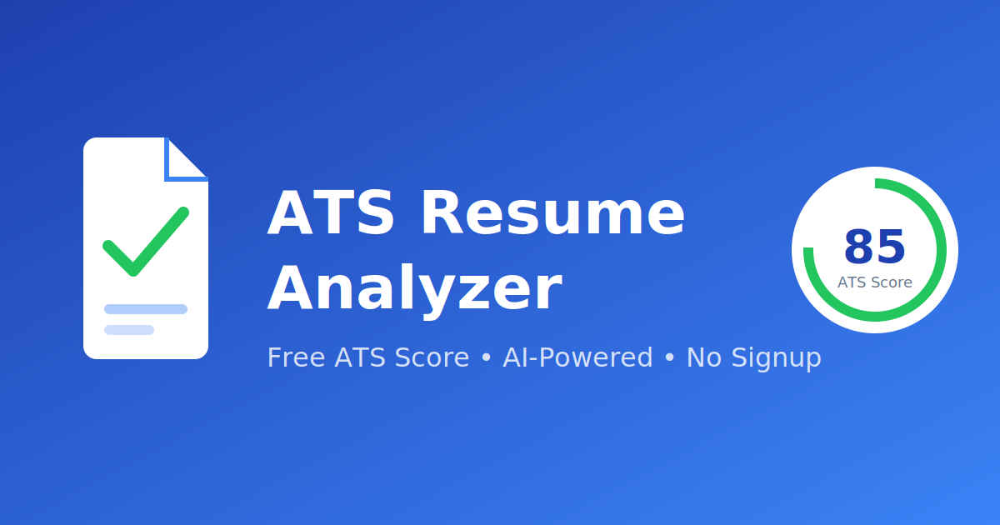

# 🎯 ATS Resume Analyzer

[](ats.lovexog.me)
[](https://resume-ats-backend.onrender.com/)
[](https://github.com/itslovepatel/Resume-ATS)
[](LICENSE)

> **Free ATS Resume Checker** · AI-Powered Resume Scanner · No Signup Required · Instant ATS Score

A modern, AI-powered **ATS (Applicant Tracking System) Resume Analyzer** that helps job seekers understand how their resume performs in automated screening systems. **Supports 25+ industries** including Software, Healthcare, Finance, Legal, Education, and more!

🔗 **[Try it Live →](https://resume-ats-frontend.vercel.app/)**

<!-- Project preview / OG image (also used for social shares) -->



## ✨ What It Does

Upload your resume (PDF or DOCX) and get instant, comprehensive analysis:
- See your ATS compatibility score (0-100)
- Understand what's working and what needs improvement
- Get AI-powered suggestions tailored to your industry
- Download a detailed PDF report

## 🏭 Supported Industries (25+)

| Technology | Business | Healthcare | Other |
|------------|----------|------------|-------|
| Software / IT | Marketing | Healthcare / Medical | Legal |
| Data Science / AI | Finance / Banking | Pharmaceutical / Biotech | Education |
| Cybersecurity | Sales | | Real Estate |
| Design / UX | Human Resources | | Hospitality |
| | Operations / Supply Chain | | Retail / E-commerce |
| | Consulting | | Government |
| | Project Management | | Non-Profit |

## 🚀 Features

- **ATS Compatibility Score**: Get a comprehensive score (0-100) showing how well your resume will perform
- **Candidate Profile Extraction**: Automatically extract name, email, phone, LinkedIn, and GitHub
- **Domain Detection**: AI detects your primary job domain (IT, Data, Marketing, Finance, etc.)
- **Skills Analysis**: Comprehensive breakdown of technical skills, frameworks, tools, and soft skills
- **Projects Review**: Analyze project descriptions, technologies used, and impact statements
- **Experience Analysis**: Evaluate work experience quality, action verbs usage, and metrics
- **Issue Detection**: Identify formatting issues, missing sections, and ATS compatibility problems
- **Smart Suggestions**: Get actionable recommendations to improve your ATS score
- **PDF Report Download**: Download a professional PDF report of your analysis

## 🖨️ Local OCR Fallback (Scanned Resumes)

Resume-ATS now includes a fully local OCR fallback to handle scanned or image-based PDFs. Key points:

- The backend attempts standard PDF text extraction first (PyPDF). OCR runs only when extraction quality is poor (heuristics: text length < 800 chars, word count < 150, missing email or phone).
- OCR uses Tesseract via `pytesseract` and `pdf2image` to convert pages at 300 DPI and preprocess images (grayscale, contrast, sharpening) before OCR.
- Safety controls: max 5 OCR pages, 15s OCR timeout, never OCR DOCX, never store OCR images, never overwrite original PDFs.
- API responses include `parsing_method` ("standard" | "ocr" | "ocr_unavailable") and `ocr_confidence` ("low" | "medium" | "high").

This makes Resume-ATS more robust for scanned resumes while keeping all processing local—no cloud OCR, no external APIs.

## 🛠️ Tech Stack

### Frontend
- Next.js 14
- React 18
- TypeScript
- Tailwind CSS
- Framer Motion
- Lucide React Icons

### Backend
- Python 3.10+
- FastAPI
- PyMuPDF (PDF parsing)
- python-docx (DOCX parsing)

## 📦 Installation

### Prerequisites
- Node.js 18+
- Python 3.10+
- pip

### Backend Setup

1. Navigate to the backend directory:
```bash
cd backend
```

2. Create a virtual environment:
```bash
python -m venv venv
```

3. Activate the virtual environment:
- Windows:
```bash
venv\Scripts\activate
```
- macOS/Linux:
```bash
source venv/bin/activate
```

4. Install dependencies:
```bash
pip install -r requirements.txt
```

5. Start the backend server:
```bash
uvicorn app.main:app --reload --port 8000
```

The API will be available at `http://localhost:8000`

### Frontend Setup

1. Navigate to the frontend directory:
```bash
cd frontend
```

2. Install dependencies:
```bash
npm install
```

3. Start the development server:
```bash
npm run dev
```

The application will be available at `http://localhost:3000`

## 📁 Project Structure

```
Resume-ATS/
├── backend/
│   ├── app/
│   │   ├── __init__.py
│   │   ├── main.py              # FastAPI application
│   │   ├── models/
│   │   │   ├── __init__.py
│   │   │   └── schemas.py       # Pydantic models
│   │   └── services/
│   │       ├── __init__.py
│   │       ├── resume_parser.py # PDF/DOCX parsing
│   │       ├── skill_extractor.py
│   │       ├── domain_classifier.py
│   │       └── ats_scorer.py    # ATS scoring logic
│   └── requirements.txt
│
├── frontend/
│   ├── src/
│   │   ├── app/
│   │   │   ├── globals.css
│   │   │   ├── layout.tsx
│   │   │   └── page.tsx
│   │   ├── components/
│   │   │   ├── Header.tsx
│   │   │   ├── Hero.tsx
│   │   │   ├── HowItWorks.tsx
│   │   │   ├── Features.tsx
│   │   │   ├── UploadSection.tsx
│   │   │   ├── LoadingOverlay.tsx
│   │   │   ├── ResultsDashboard.tsx
│   │   │   ├── Footer.tsx
│   │   │   └── results/
│   │   │       ├── ScoreCircle.tsx
│   │   │       ├── ScoreBreakdownCard.tsx
│   │   │       ├── SkillsCard.tsx
│   │   │       ├── ExperienceCard.tsx
│   │   │       ├── ProjectsCard.tsx
│   │   │       ├── KeywordsCard.tsx
│   │   │       ├── IssuesCard.tsx
│   │   │       └── SuggestionsCard.tsx
│   │   └── types/
│   │       └── index.ts
│   ├── package.json
│   ├── tailwind.config.js
│   └── next.config.js
│
└── README.md
```

## 🎯 ATS Scoring Logic

The ATS score is calculated based on:

| Factor | Weight |
|--------|--------|
| Keyword Relevance | 20% |
| Section Completeness | 20% |
| Formatting Score | 15% |
| Skill Relevance | 20% |
| Experience Clarity | 15% |
| Project Impact | 10% |

### Score Categories:
- **80-100**: Excellent - Resume is well-optimized for ATS
- **60-79**: Good - Minor improvements needed
- **40-59**: Needs Improvement - Significant optimization required
- **0-39**: Poor - Major restructuring needed

## 📡 API Endpoints

### `POST /api/analyze`
Analyze a resume file and return comprehensive ATS analysis.

**Request:**
- Content-Type: multipart/form-data
- Body: file (PDF or DOCX, max 5MB)

**Response:**
```json
{
  "success": true,
  "candidate": {
    "name": "John Doe",
    "email": "john@example.com",
    "phone": "+1-555-123-4567",
    "location": "New York, NY"
  },
  "ats_score": 85,
  "score_category": "Excellent",
  "domain": {
    "primary": "Software / IT",
    "confidence": 0.92
  },
  "skills": {...},
  "experience": {...},
  "projects": [...],
  "issues": [...],
  "suggestions": [...]
}
```

### `GET /health`
Health check endpoint.

## 🔒 Security

- Files are processed in memory and immediately deleted after analysis
- No data is stored on the server
- No user tracking or analytics
- No signup required

## 🚧 Future Features

- [ ] User authentication and resume history
- [ ] Job description matching
- [ ] AI-powered resume rewriting
- [ ] Recruiter dashboard
- [ ] Resume comparison
- [ ] Industry-specific scoring

## 📄 License

MIT License - feel free to use this project for personal or commercial purposes.

## 🤝 Contributing

Contributions are welcome! Please feel free to submit a Pull Request.

---

Built with ❤️ for job seekers everywhere
